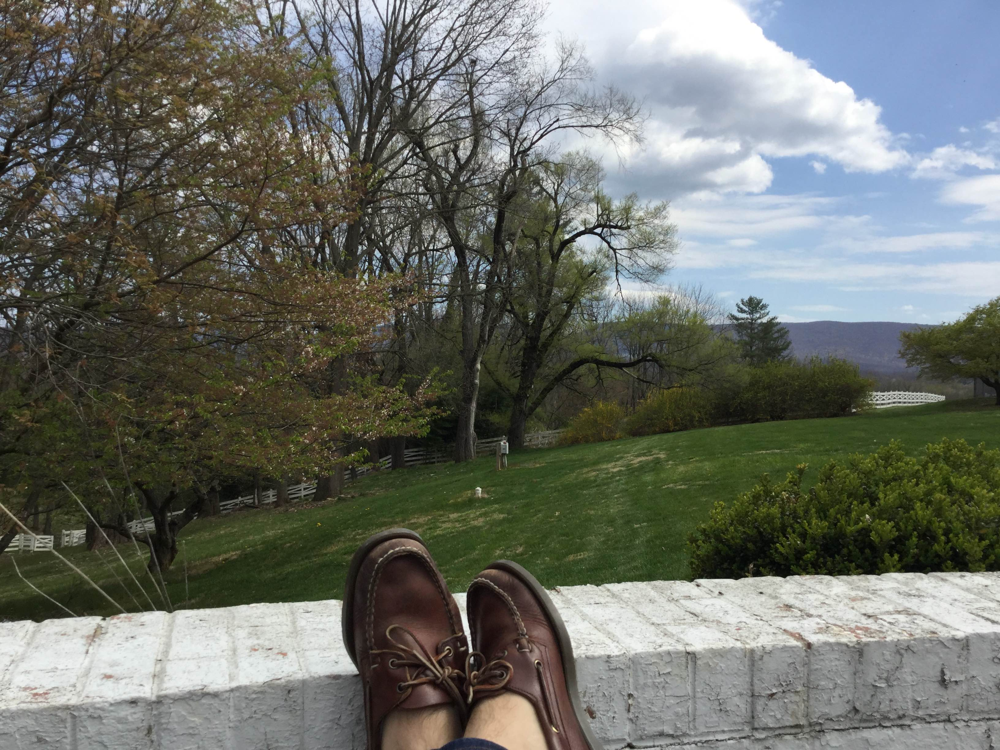

It's time to get back to it. Pandemic has meant quarantine, and quarantine has felt like a bit of vacation–not the most fun vacation, but some kind of a vacation. I think most of us have been primarily focused on staying sane, keeping our jobs, and planning for tough times. 

I haven't been to the office in months and I've been living with my family in Virginia for most of that time. Because of the circumstances, most of my planning and self-evaluation has been pretty modest. In terms of goals:

- I paused a weight cut because I figured now was not the time to add another source of stress to my life. And it's harder to do this when eating your parents' home-cooked food.

- Any gym goals halted when the gyms closed.

- I've cut myself some slack with work as I adapt to working remotely.

- More of my time is spent on activities I would normally consider a waste, in service of maintaining my sanity.

Overall, it's been like a summer break; it feels as if life has been on pause. But I think that's over–time to set some goals.

